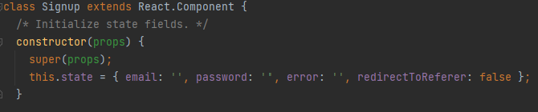
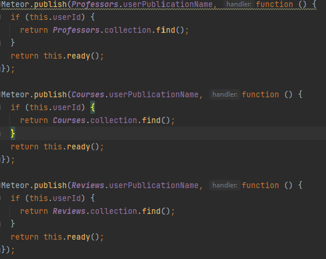
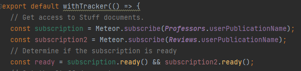
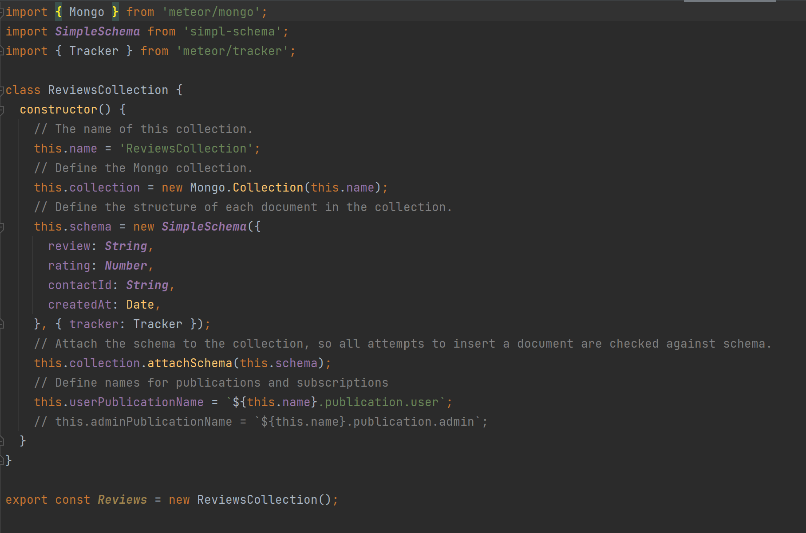
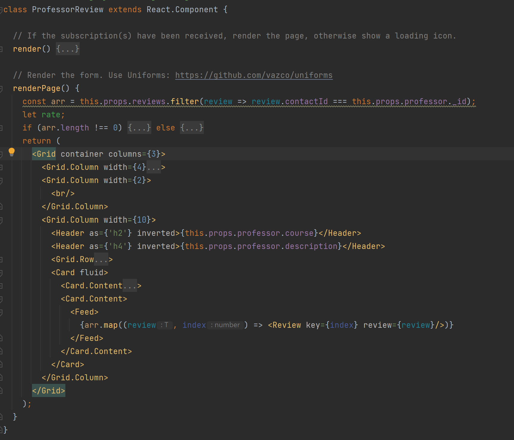
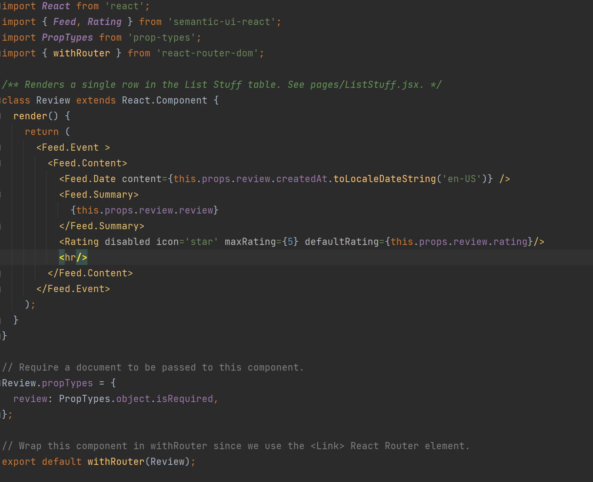
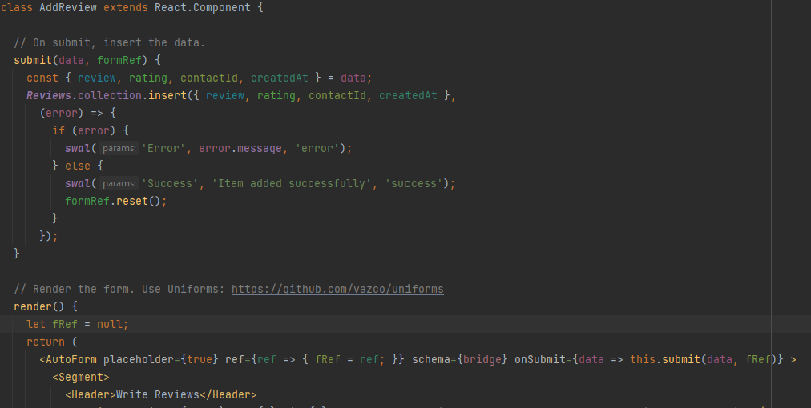
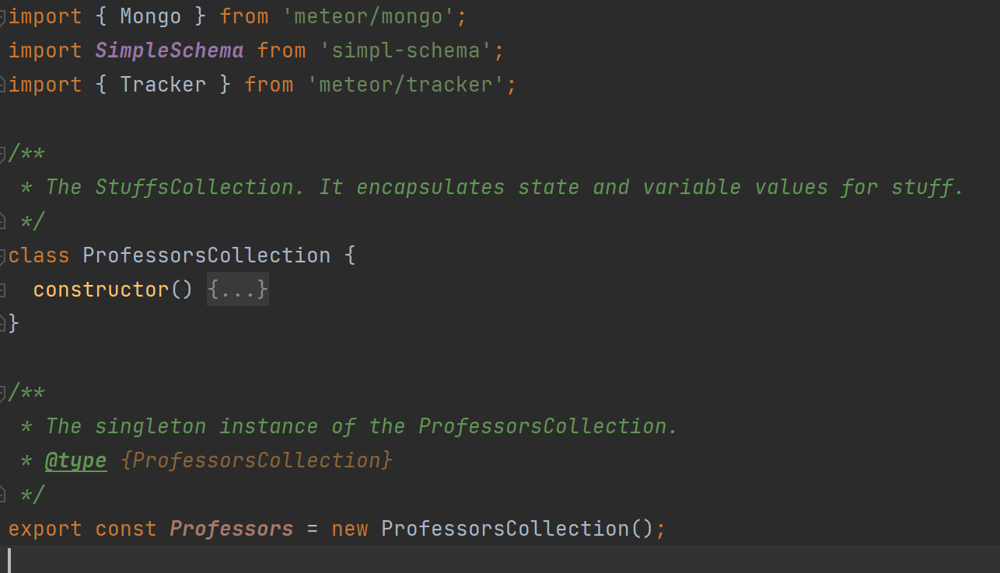

###What is the easy way?
The easy way to make Web app is the design pattern. "A design pattern describes a problem that occurs over and over again in our environment, and then describes the core of the solution to that problem, in such a way that you can use this solution  a million times over, without ever doing it the same way twice."--Christopher Alexander, 1977.

In another words, design patterns are just like templates or parent classes. You can make a the general solution (or maybe just how to solve a problem) in the template. Then apply this template to many different situations.

###Why is it a easy way?
Some people may want to ask why is it easy since it seems you are just writing extra documentation which has no use to the actual problem?

Let me explain this with my own web design experience. 

First is the design pattern from the javascript which is called Prototype.

In this image, I create a Prototype object called Signup which extends React.Component to get clones of react components which will be used later on to construct the Signup page. This might be not so clear on the Prototype design pattern. A better example will be like `class Circle extends Shape`. The object Circle will clone Shape and override with its state and function which is easier to start everything all over again.

Second is the design pattern from the Meteor which is called Observer(Publish-Subscribe). That is an object maintains a list of its dependents and notifies them automatically of any state changes.

This is publish call.

This is subscribe call.

In first image, I published the collections of professors and reviews while the user is logged in. Then in the second image, I pass the name of publication associate with professor and review collections and call the subscribe to access the professor and review data. So in this design pattern the data base is connected with the page where needs to use the data.

Third is the design pattern from the Meteor which is called MVC (Model-View-Controller).

This is model.

This is view.

These two combines as controller.

In the first image, I create a model (MongoDB) with review collection. In the second image, I create a view to display all data in the review collection. In the third and forth image, I create a controller to act on both model and view that it controls the data flow into model object and updates the view whenever data changes. Therefore, the application's concerns are separated but still can interact with each other.

Last but not least is the design pattern called Singleton.

In the image, I create a class called ProfessorCollection to manage access to the MongoDB collection named "ProfessorCollection". A single instance of this class is created (variable "Professors") and exported to the rest of the application. Clients invoke methods on this instance to manipulate the collection such as publish, subscribe etc.

###Conclusion

From all these design patterns I am using, I don't have to solve or write code one by one to get everything connected and working as a whole. And it's very easy to do the same thing to a similar situation or problem based on these design patterns. Therefore, using design patterns is the easy way to make a web application.