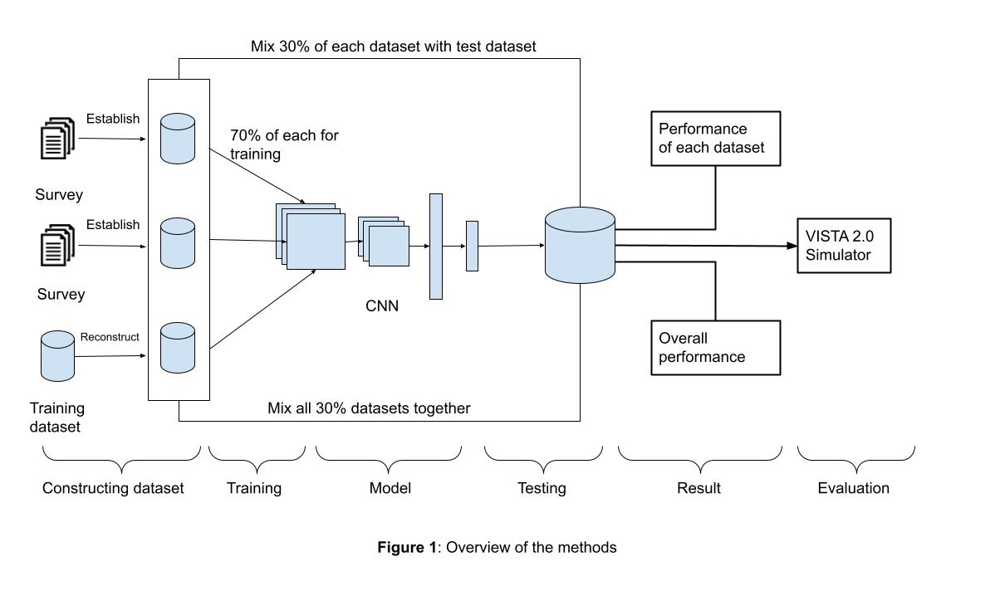

<h3>Background & Motivation</h3>
With the development of AI especially the neural network deep learning models, 
more and more autonomous vehicles are available and running in the public.
Researchers forecast that by 2025 we’ll see approximately 8 million autonomous or semi-autonomous vehicles 
on the road.[1] AI will become the main decision-making source for any self-driving cars that are at least 
at level 2 of autonomy [2] which leads to concern for the public's safety as the result of the uncertainty of AI. 
Autonomous vehicles replied on cameras, lasers, radar, and other sensors to gather information from the environment 
and process those data using a pre-trained neural network AI model to detect different objects. 
Although the state-of-art models have a high performance in object detection under a normal autonomous-driving 
environment, applying them under various special situations is another challenge such as bad weather, 
unexpected objects (such as plastic bags), and signals from other objects. The wrongful object detection under 
these special situations will lead to safety issues, which are accidents more than likely. For example, 
if the model detects a flying plastic bag in front of the car as a pedestrian it will slam the brake which may 
cause a crash if the car behind it thought it will keep driving. These difficulties and errors are mainly attributed 
to the lack of data for these special situations in the training dataset. Most datasets that the models are trained 
on are for normal objects such as cars, pedestrians, traffic lights, and traffic signals. There are not many datasets 
about the special situations mentioned above. Thus, I believe adding the new datasets to the training process can help 
the model learn about such situations and make the correct decision accordingly.

<h3>Central Hypothesis</h3>
I hypothesize that 
1. detecting the false-positive object (False-positive object means that it will be detected, 
and AI will take action while it will not affect driving at all),
2. detecting the signal from other objects, 
3. detecting objects in bad weather would enhance the overall performance of object detection for 
autonomous vehicles and therefore, will increase the safety level and trustworthy level of the vehicle.\

<h3>The whole essay can be viewed at</h3> [Essay](../doc/ai.pdf)
