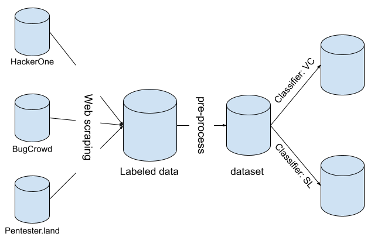

<h3>Introduction</h3>

Secure software is the foundation of a high-quality soft-
ware system. Business models have shifted to include se-
curity in the software development life cycle due to the
high cost of insecure applications and systems. Cybercrime
is expected to cost the world $10.5 trillion annually by
2025 [1]. Despite the increase in cybercrime, on December
13th, 2016, Congress passed the 21st Century Cures Act [2],
which requires healthcare providers to publish application
programming interfaces (APIs) to provide complete access
to all data formats and elements (known as "resources")
of a patient’s electronic health record (EHR) within one
year of the date of enactment. Health Level Seven Inter-
national (HL7), a healthcare standards organization, created
the Fast Healthcare Interoperability and Resources (FHIR,
pronounced "fire") API, which built upon earlier versions of
HL7 data format standards. However, the FHIR API offered
easy-to-use implementation through HTTP-based RESTful
API protocol with resources represented in either RDF,
XML, or JSON formatting, ultimately leading to the FHIR
API protocol being widely accepted across the healthcare
industry. Research published by cybersecurity analyst Alissa
Knight [3] has revealed that five separate insecure implemen-
tations of the FHIR API protocol exposed over four million
patient and clinician EHR resources across forty-eight mobile
web clients and 25,000 healthcare providers and payers.

In September 2018, Facebook announced a vulnerability
in its API code that resulted in the exposure of data from
fifty million users and the theft of API access tokens [4]. This
event followed Cambridge Analytica’s abuse of Facebook’s
API security infrastructure, which allowed them to acquire
data on eighty million Facebook users [5]. Despite the
availability of patches to secure API frameworks, organi-
zations often fail to implement them in a timely manner.
For example, Equifax failed to patch a vulnerability in the
Apache Struts framework used for their API, resulting in the
exposure of personal information and social security numbers
of over 143 million US citizens, with damages totaling more
than 68 billion dollars [6].

The examples provided above are of large, known security
events that have been reported. However, according to a
survey conducted in 2017 on US companies with at least
250 employees or $1 million in revenue, the average-sized
business manages as many as 363 public-facing APIs [7].
Furthermore, the Postman API Platform - a platform used
by more than 17 million developers worldwide to build and
use APIs - reports that the number of grouped API requests
collected by their software has increased from less than half
a million in 2016 to over 46 million as of January 2021,
indicating that API usage is rapidly increasing [8].
The increasing use of cloud computing and remote work
has led to a greater reliance on third-party APIs, which were
originally designed for back-end applications that are not vis-
ible to the user [9]. However, the generic reuse of these APIs
can lead to vulnerabilities, as identified by cybersecurity
analyst Alissa Knight [3]. Average-sized businesses are more
likely to use a readily available third-party solution with-
out researching it properly. Unfortunately, common security
measures such as web application firewalls and vulnerability
identification software may not detect or prevent misuse of
APIs as the attack vector is through the feature that makes
APIs desirable. To secure APIs and protect existing networks,
it is necessary to compare research publications on APIs with
common vulnerabilities and weaknesses identified through
bug bounty programs.

In this paper, we investigate publicly available bug bounty
reports from HackerOne [10], BugCrowd [11], and Pen-
tester.land [12] to identify common vulnerabilities and weak-
nesses regarding APIs. We also discuss the severity of
our findings when compared to existing publications and
known issues captured through common vulnerability and
weakness enumeration using mitre.org. This approach is
different from previous works, which focus on conducting
surveys to identify demographics about API use, classifying
previous API vulnerabilities, and balancing API security with
API implementation in terms of functionality, speed, and
performance. We concur with recent findings by Knight [3]
that existing vulnerabilities can be classified into multiple
categories aligned with the Open Web Application Security
Project (OWASP1) API Security Top 102 [13]. We expand
existing work by providing the following contributions:
1) We perform a large scale empirical study on bug bounty
   reports regarding API vulnerabilities and weaknesses.
2) We identify common critical and important API vul-
   nerabilities discovered in the bug bounty process using
   Microsoft’s security update severity rating system.
3) We determine if mapped research publications, that use
   security bug reports, capture the API vulnerabilities
   and weaknesses identified in our large scale empirical
   research of bug bounty reports regarding API vulnera-
   bilities and weaknesses.

   Our research addresses the challenges faced by devel-
   opers and security researchers by determining real-world
   vulnerabilities and weaknesses identified through relevant
   bug bounty reports. This helps developers assign severity to
   common API vulnerabilities and validates existing research
   and security practices related to APIs. As a result, developers
   and security researchers will have a deeper understanding of
   API security from both academia and industry, enabling them
   to enhance their own API security practices.

<h3>Conclusion</h3>
We conducted a large-scale empirical study on bug bounty
reports related to API vulnerabilities and weaknesses. We
identified common critical and important API vulnerabilities
discovered in the bug bounty process using Microsoft’s
security update severity rating system. We also established
a method to determine the severity ranking of a vulnerabil-
ity by using the weighted values from the Department of
Defense Iron Bank in the Overall Risk Assessment Calcu-
lation [32]. We cross-validated our findings with OWASP
Top 10 to determine the change in occurrence of each
vulnerability. Our research can assist developers in identi-
fying real-world vulnerabilities and weaknesses, assigning
severity to common API vulnerabilities, and validating the
OWASP Top 10 for API vulnerabilities. Additionally, our
study provides a pathway for researchers to study and tackle
common vulnerabilities.

<h3>The whole essay can be viewed at </h3> [Essay](../doc/api.pdf)
