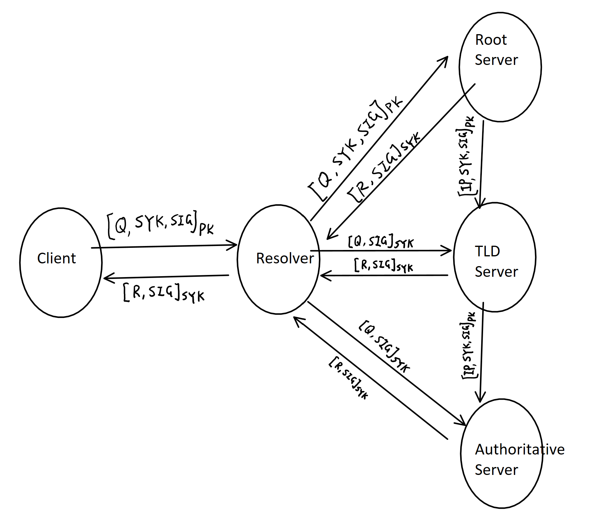

<h3>Introduction</h3>

Domain Name System (DNS) is the hierarchical and decentralized naming system used to identify computers, services, and other resources reachable through the internet or other IP network. The resource records contained in the DNS associate domain names with numerical IP addresses. Currently, the DNS protocol uses two types of DNS messages, queries, and replies which are sent through the network using UDP plain text. Therefore, it is vulnerable and not secure at all. Anyone can try to read whatever website you are trying to visit or even worse they can hijack the message and send you a fake message with the IP address to their website. In this paper, we will discuss the problem with the domain name system mainly for the connection vulnerability, current solutions with the pros and cons, and the potential solution I developed with the pros and cons.

<h3>My Idea</h3>
I have developed a secured mechanism for the domain name system in which all the transactions will be secured that even if a man-in-the-middle attack happens, the attacker will not be able to read or modify the message. And a fake server will not be able to enter into the communication between any of the DNS servers and gain access. Also, this secured mechanism will keep the log files of the unsuccess connections attempts. This mechanism is mainly for the connection between the client and server, different servers. Also, it is based on the assumption that the encryption algorithm is strong enough and the server is secured. The design is shown in the above picture.

<h3>Notations for the picture</h3>
Symmetric Key: SYK, 

Secret (private) Key: SK,

Public Key: PK

Client: C

Resolver server: RS

Root server: RT

TLD server: TS

Authoritative server: AS

Signature: SIG

<h3>Conclusion</h3>
This mechanism is able to secure the DNS query and reply transportations with the cost of some extra waiting time due to the encryption and decryption. The man-in-the-middle attack and hijacking attack can be prevented by this mechanism. However, there are still some issues that need to be resolved before it can be used in the real world, such as the multiple users’ connection, DoS attack as the encryption and decryption will be using more computing power.

The whole essay can be viewed at [Essay](https://drive.google.com/file/d/1wGdjass_0XXI9XLDd1fyaPhjmziS4jTw/view?usp=sharing)
