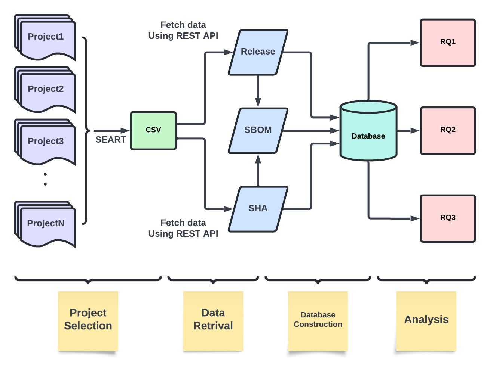

<h3>Introduction</h3>

In today’s software-centric landscape,
comprehending the intricate interplay of dependencies
within a project stands as a pivotal pillar for ensuring
security, compliance, and transparency. As software
ecosystems burgeon in complexity, the imperative
for robust documentation of these dependencies has
never been more pronounced. This is precisely where
the Software Bill of Materials (SBOM) assumes its
significance.

Originating from the manufacturing industry, where
a bill of materials (BOM) served as an inventory
roster of sub-assemblies and components within a
parent assembly, the SBOM emerges as the
software equivalent—a foundational construct vital for
fortifying software supply chain security. Functioning
as a nested inventory, the SBOM meticulously
enumerates the software components comprising a
project. It delineates these components, furnishing
pertinent information and delineating the supply chain
relationships interlinking them. Essentially, the
SBOM functions as a comprehensive ledger, cataloging
all components, libraries, frameworks, and software
artifacts incorporated within a project. Its utility
lies in furnishing invaluable insights into the project’s
composition, empowering developers, stakeholders,
and security professionals to navigate vulnerability
management, licensing compliance, and risk mitigation
strategies with informed precision.
However, despite the manifold benefits of SBOMs,
their adoption trajectory remains somewhat subdued. A
significant proportion of existing third-party software or
components—whether open source or proprietary—lack
accompanying SBOMs. Ideally, SBOM generation
should commence early in the software development life
cycle, gradually accruing enriched information through
subsequent stages. The absence of a unified
package manager exacerbates this issue in the realm
of C/C++ development, rendering SBOM generation
an arduous task. Nonetheless, during our preliminary
investigations, we discerned that GitHub’s built-in
SBOM feature seemed poised to provide insights into
C/C++ projects, prompting us to delve deeper into its
potential.

This document serves as an instructional blueprint
for conducting an SBOM study on C/C++ projects
hosted on GitHub. Through meticulous analysis,
extraction, and documentation of dependencies and
associated metadata, our objective is to address the
following research questions (RQs):
- RQ1: How frequently do developers update
project dependencies? 

Understanding the cadence of updates to project
dependencies is pivotal for gauging project maintenance
and evolution. Through scrutiny of version control
history, commit logs, and release notes, we endeavor to
discern the frequency with which developers integrate
dependency updates. Factors such as the project’s
development tempo, the exigency of security patches,
and the availability of new features or bug fixes
in upstream dependencies influence update frequency.
Furthermore, examining patterns of dependency updates
over time offers insights into the project’s overarching
maintenance strategy and its responsiveness to emergent
issues and advancements within the software realm.
- RQ2: What are the common libraries that
undergo changes?

Unveiling common libraries subject to changes
provides valuable insights into evolving project
requisites, technological trends, and community-driven
development dynamics. By parsing through version
control history and dependency manifests, we aim to
pinpoint libraries frequently updated or replaced. These
may encompass core dependencies like frameworks,
utility libraries, or platform-specific components.
Understanding the rationale behind these changes
can illuminate the project’s adaptability to evolving
technologies, performance enhancements, or shifts in
development paradigms.
- RQ3: What are the reasons behind these
changes?

Delving into the motives driving dependency
changes furnishes contextual understanding of the
project’s development trajectory and decision-making
ethos. By dissecting the rationale underlying
dependency alterations, we aspire to glean deeper
insights into the project’s prioritization of stability,
security, performance, and feature enhancements.
Furthermore, this exploration sheds light on the project’s
alignment with industry standards and best practices,
elucidating its strategic evolution within the software
landscape.

<h3>Methodology </h3>

The methodology employed for establishing the
database aimed to ensure systematic organization
and comprehensive coverage of Software Bill of
Materials (SBOM) information extracted from GitHub
repositories. Through meticulous project selection
criteria, data retrieval procedures, and database
construction steps as shown in Figure above, we laid the
foundation for a robust dataset conducive to in-depth
analysis and inquiry.

<h3>Conclusion </h3>

The findings from this study shed light on various
aspects of dependency management practices and their
implications for software development. Through the
exploration of three research questions, we gained
insights into the frequency of dependency updates,
common libraries undergoing changes, and the reasons
behind dependency changes.

Firstly, our analysis of the frequency of dependency
updates revealed a wide spectrum of update patterns
across software projects. While some projects exhibit
minimal changes and stable release intervals, others
demonstrate dynamic update cycles with frequent
releases. Understanding these patterns is crucial for
developers to optimize resource allocation, balance
stability with innovation, and ensure the overall health
of software projects.

Secondly, our investigation into common libraries
undergoing changes highlighted the prevalence of
GitHub Actions workflows and diverse ecosystems of
dependencies. GitHub Actions workflows play a pivotal
role in enabling automation and CI/CD processes, while
the heterogeneous nature of dependency ecosystems
underscores the diversity of tools and technologies used
in software development.

Finally, our examination of the reasons behind
dependency changes uncovered common themes and
patterns in release notes and commit messages. By
analyzing textual data, we identified prevalent terms and
phrases indicative of bug fixes, feature enhancements,
and performance optimizations. Understanding these
reasons can inform developers’ decisions regarding
prioritization, resource allocation, and overall software
quality improvement efforts.

In conclusion, this study provides valuable insights
into dependency management practices and their
implications for software development. By leveraging
these insights, developers can make informed decisions
to optimize their development workflows, ensure project
stability, and deliver high-quality software products to
end-users.

<h3>The whole essay can be viewed at </h3> [Essay](../doc/SBOM-C-C++.pdf)
