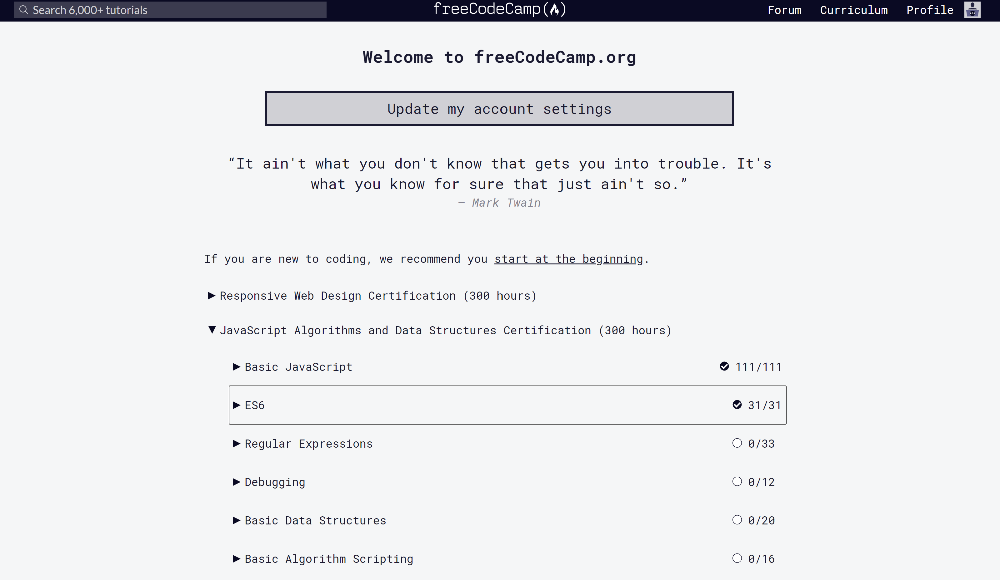

# Java VS JavaScript 
As new to the Javascript, I find it is kind easy to switch from Java to Javascript as they have the same basic concepts and framework. The biggest difference that I experienced is that in Javascript when you declare a variable, you don’t need to declare it’s data type (no return type for functions). This can be either a good or bad thing. For the good side, the code will look cleaner and also for some cases you can just have one function to return both number and string instead of java’s one function for each data type. For the bad side, it will be harder for programmers to debug and easy to lose track of the variable which will require a much clearer variable name. Another difference is you don’t need a main method to print out the results and also it can print entire array and list without loop which is more convenient than in java. With these being said, I think Javascript is better than java so far (I may change my mind as get deeper into Javascript and find it is much harder).

# How to start
As a programmer, the best way to learn a programming language is through practices (think and write in that language). So I started with freeCodeCamp to learn Javascript. It has 111 practices problem in the basic and 31 practices problem in ES6 which is a great way to start learning Javascript. And the WOD (work of the day) provided by my ICS 314 class is also very helpful for me to get familiar and better with Javascript. Nothing motivates me more than the enjoyment of solving a problem, so I really like this WOD thing that I encourage everyone who just start learning a programming language to do the same thing. There is a website called leetcode, which have a list of problems ranking from easy to hard, that can serve the same purpose. Do at least one problem a day you will find yourself getting better with that language.

