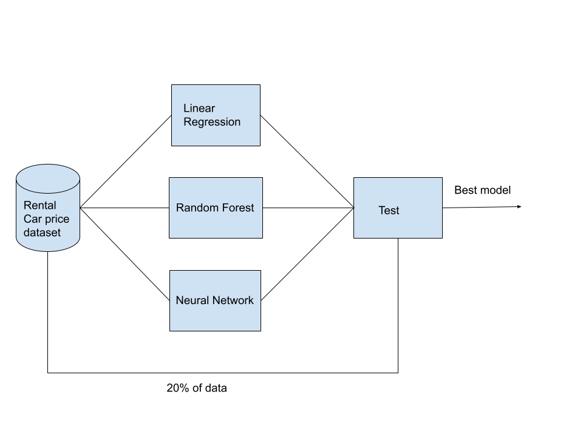

<h3>INTRODUCTION</h3>
According to a worldwide car rental analysis, there is about $4 billion 
revenue increase every year since 2023 within the car rental industry. 
The major key player is other (42%) which are online (67%) P2P car sharing business 
including Turo, GetAround.[1] Rental cars are an essential part of modern-day travel, 
offering a convenient means of transportation for both leisure and business travelers. 
However, the cost of renting a car can vary significantly based on a variety of 
factors, such as location, time of year, type of vehicle, and duration of rental. 
With such variability, it can be challenging for both rental car companies and 
consumers to accurately predict rental car prices. This report aims to address 
this issue by utilizing data analysis and machine learning techniques to develop 
a rental car price prediction model. By examining Turo rental car data (HI specific), 
I aim to identify the most influential factors that impact rental car prices and 
use this knowledge to develop an accurate prediction model. Ultimately, this report 
seeks to provide valuable insights to both rental car companies and consumers by 
providing a tool to predict rental car prices with greater accuracy and precision.

<h3>CONCLUSION</h3>
In conclusion, this study aimed to develop a machine learning model for predicting 
rental car prices based on various features such as the car's make, model, 
type and year. The results demonstrate that the developed model achieved a 
reasonably accurate prediction of car prices with a mean absolute error of 7.58. 
However, there are still limitations to the approach, such as the use of a single 
dataset for training, testing, and validation, and the exclusion of categorical 
features. Future work can explore incorporating more complex neural network 
architectures, adding more features such as text or image data, and exploring 
techniques for handling missing data.

Overall, the developed machine learning model has the potential to be a useful tool 
for individuals looking to rent cars on Turo or for car owners to accurately price 
their cars on Turo. By automating the pricing process, it can save time and 
resources while also improving the accuracy of the predictions. This study 
contributes to the growing body of research on using machine learning techniques 
for predicting rental car prices and provides a foundation for future work in 
this area.

<h3>The whole essay can be viewed at</h3> [Essay](../doc/ml.pdf)
