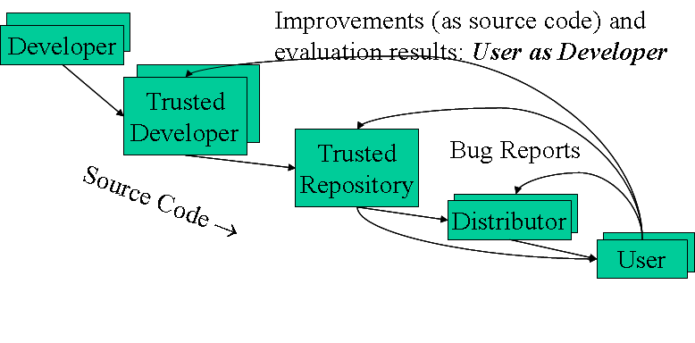

Although the technology stack of the ICS 314 class I took in Spring 2021 is designed for the creation of web application, the more fundamental goal is to teach or show the different fundamental software engineering concepts such as _Open Source Software Development_, _Coding Standards_, _Design Patterns_, _Agile Project Management_, _Ethics in Software Engineering_ and so on.

I will talk about the progress of me learning the software engineering from this class in some of the concepts.

I have already talked a little about the [Design Patterns](A-easy-way-to-make-web.md) and [Coding Standards](Walking-on-the-ruler.md) in my previous essays. (Click the link to check out) Here I will focus on the other 3 concepts mentioned above.

### Open Source Software Development

Open source software development is the process by which open source software, or similar software whose source code is publicly available, is developed by an open source software project. These are software products available with its source code under an open-source license to study, change, and improve its design. (definition from Wikipedia). 

In the class we are using [meteor-application-template-react](https://github.com/ics-software-engineering/meteor-application-template-react) as the open source web application. Then either fork or use it as template to develop our own version of web application [uh-ratings](https://uh-ratings.club/#/). In this way we save the time of doing some redundant repeating work such as create the basic web page. We can simply modify this template to the way we want. And also it can provide some example of how the components and pages are connected and how the database get involved. And our version of web application can also be another open source web application for someone else to study, change and improve. The source code is in the [uh-ratings organization](https://github.com/uh-ratings).

This is not only useful for web applications but any other software. The well know example is Linux. Since it's an open source software, there are many different distributions base on it such Ubuntu, Debian, Mandriva etc. There might be a lot difference between the software and web application in details but the open source software development concept is the same.

### Agile Project Management

Agile project management is an iterative approach to delivering a project throughout its life cycle. It is designed for teams of two or more members, who break their work into goals that can be completed within time-boxed iterations.

In the class, we have used a style of agile project management called Issue Driven Project Management(IDPM). IDPM is an agile project management process designed to support up to a dozen developers creating software up to approximately 500K LOC with “web app” grade quality.

The guidelines of IDPM:

    1. Meet twice a week to manage project
    2. Divide work into 72 hour tasks
    3. Document each task as a Github issue
    4. Perform work associated with each task in its own branch
    5. Manage progress using milestoens which provide "deliverables" every 7-14 days
    6. The To Do column of the currently active Project Board should have at least one Issue per team member

For this class, we use Github Project Board to manage progress within a Milestone. We divided the work of each Milestone into smaller Github issues which have their own branches and assigned evenly to every member in the team. We meet at least twice a week via Discord to manage our project. And we provide a deliverable system for each Milestone about every 12 days. All the project board can viewed [here](https://github.com/uh-ratings/uh-ratings/projects).

This is a very organized and efficient way not only for developing the web application but also for developing all kinds of software. First we can divide the project of developing the software into Milestones. Then within each Milestone create 72 tasks/issues and assign to each member. Team members will meet and communicate at least twice a week to manage the progress. Then about every 10 to 14 days gather all the finished tasks and deliver the beta version of the project for this Milestone then move to the next. This project management is so powerful than I will definitely see myself applying it to all kind different projects.

### Ethics in Software Engineering

Ethics are always playing a very important role in a lot of fields. As a student, your ethics can be very simple such as honest, no cheating or plagiarism. As a software engineer, there are more ethic requirements applied since computing professionals' action change the world. Just like in the image above, the unethical action of not reporting a deadly safety flaw may cause the deaths of a dozen customers. That's why we as future software engineers need learn the [ACM Code of Ethics and Professional Conduct](https://www.acm.org/code-of-ethics).

In class, we have discussed the most recent event that [Linux Foundation banned University of Minnesota](https://www.theverge.com/2021/4/30/22410164/linux-kernel-university-of-minnesota-banned-open-source). A UMN research group has performed an experiment that they'd been able to introduce vulnerabilities into the Linux kernel by submitting patches that appeared to fix real bugs but also introduced serious problems without notify anyone in the Linux community. Although the purpose and result (introduce the potential human error and its influence) maybe useful to the community, but the way they perform the experiment has broken several ACM code of ethics which makes Linux Foundation decide to ban UMN until they resolve all the problems. Even though this experiment did not cause any really damage, but the unethical action waste a lot developers' time and effort which therefore leads to a serious consequence.

We, as software engineers who use computing technology in an impactful way, need always follow the code of ethics and professional conduct for our own and public good.