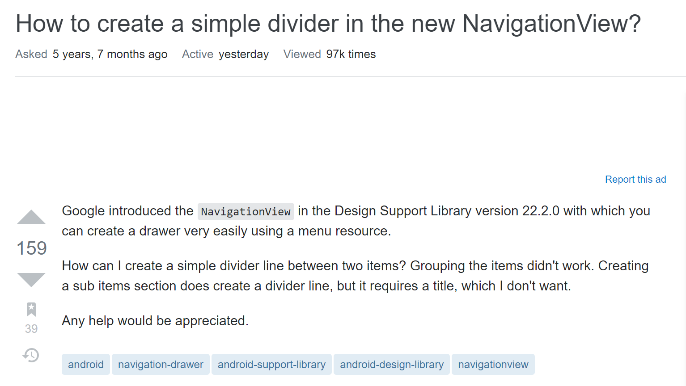

A smart question will be a type of questions that hasn’t been asked with a meaningful, specific subject header and using a clear, correctly-spell, grammatical language to describe precisely about the question. 
This type of question is smart because first it is not a question that someone already asked before so it will not waste either your time or others’ time. 
Second with the meaningful, specific subject header it can help the viewer know what this question is about, so it can draw the help from those professional in this kind subject. 
Third with the clear, correctly-spell, grammatical language to describe precisely about the question will help people know exactly what your problem is to get the result you want and provide clear direction in how to solve your problem.
Therefore, asking a smart question is helping people to understand your question quickly and clearly then they can give you the best possible solution faster so that it helps yourself.

Here is an example of a smart question. The header is “How to create a simple divider in the new NavigationView”. It described the expected result “create a simple divider” and specified the subject or the application should be in. In the question body, it states the version so people will know the background condition and then it gives the expected result “create a simple divider line between two items” so people know what he wants. Also it tells people the method he already tried “grouping items didn’t work” and “creating a sub item does work, but require a title which I don’t want.” At the end, he is courteous by saying “any help would be appreciated.” This smart leads to a very effective and efficient answer that people replied that “all you need to do is define a group with a unique ID”. This question fulfilled the precepts for smart questions therefore it gets a fast and effective answer. The question can be found in Source: <a href="https://stackoverflow.com/questions/30625280/how-to-create-a-simple-divider-in-the-new-navigationview"></i> HERE </a>

Here is an example of a not smart question. The header is “Best practices for custom helpers in Laravel5”. This is not meaningful or specified. It is actually very confusing. It sounds more like helping people to practices in Laravel5 than asking for help (which it does ask for help in the body of the post). In the question body, it did give the goal “create helper functions to avoid repeating code between views in Laravel 5". Then it posted some code but without explanation such as “this is where the code should be in”. And then it kind changed the whole question by the last sentence. It was originally asking  “create helper functions” but at the end it changed to “create a file with these functions” which makes the people who answer the question have to edit his answer again after 7 months to include second way to solve the problem. This question is not fulfilled the precepts for smart questions therefore it gets a separated answer after 7 months. The question can be found in Source: <a href="https://stackoverflow.com/questions/28290332/best-practices-for-custom-helpers-in-laravel-5"></i> HERE </a>

As a result of this experience, I learned that before you ask a question you should search it first then you might find some similar or same question someone else already asked before so it can save you and others’ time. And a meaningful and specified subject header can help you get help from the people who is expert in this subject. The precisely description of the question and expected result will get you the right help way faster. So asking a smart question is not only helping others to understand and help you better but also saving time for both side.
