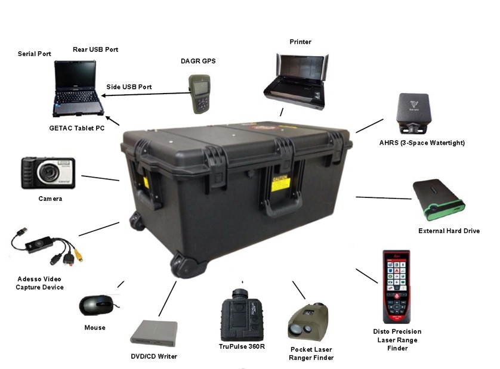

  

While i servered in the Army as a combat engineer, we got the new equipment ENFIRE kit that no one knows how to use. I volunteered to study and develop the SOP (standard operation procedure) for my platoon and company. I teached all my battles even officers how to use the laser range finder to determine the distance, height, direction, area and so on. Also I teached them how to transfer the data from the laser range finder to the computer and use the built-in software to create a map and report. I received an AAM (Army Archivement Metal) because of that.

You can learn more about the ENFIRE kit at the [Army ENFIRE kit](https://www.army.mil/article/201315/rapid_data_collecting_tool_kits_to_be_delivered_across_corps_of_engineers).

