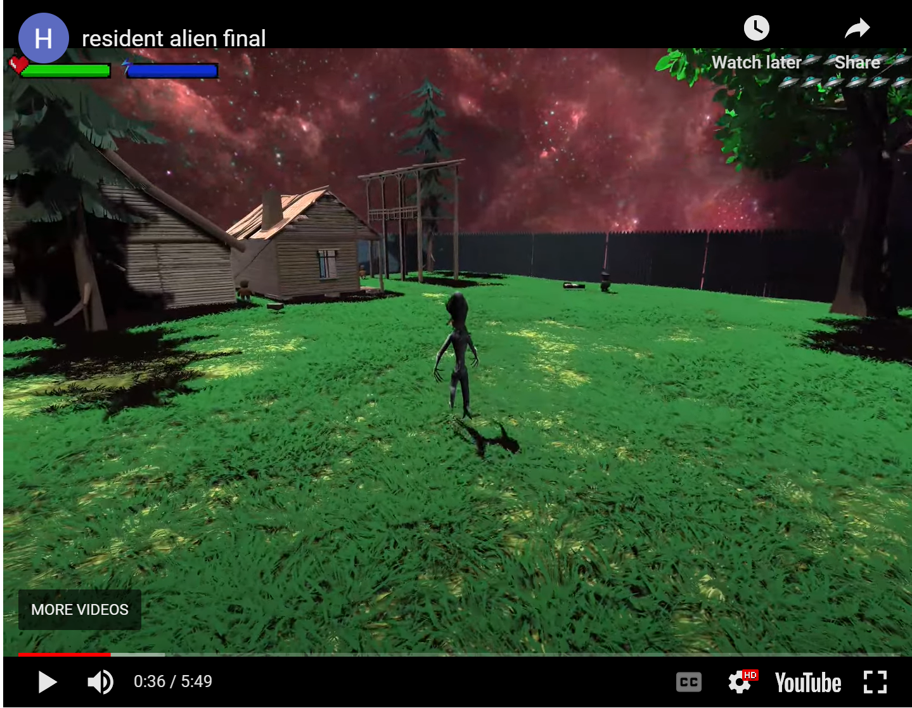

<iframe width="560" height="315" src="https://www.youtube.com/embed/USLbCHkeDRs" frameborder="0" allow="accelerometer; autoplay; clipboard-write; encrypted-media; gyroscope; picture-in-picture" allowfullscreen></iframe>

We have brainstormed to come up with this game concept of a 3D 
thrilling game where you play as an alien trying to fix your crashed 
spaceship and escape from the inspired by the TV show Resident Alien. 
The game will be a third-person game with a focus on exploration and 
puzzle-solving. The game will be set in a large open world with a 
variety of environments, including forests, mountains, and deserts. 
The game will feature a variety of skills that the player can use to 
fight off enemies and solve puzzles. The game will also feature a 
variety of enemies, including humans, robots, and other aliens. 
The game will have a strong focus on story and character development, 
with a variety of side quests and other activities for the player 
to engage in. The game will be developed using the Unity game 
engine and will be released on PC and consoles.

### Documentation
If you want to know more about the game please visit [Resident Alien](https://resident-alien-game.github.io/).

### Download
Also, the game can be downloaded from [Resident Alien Game](https://hangbo.itch.io/resident-alien-game).
