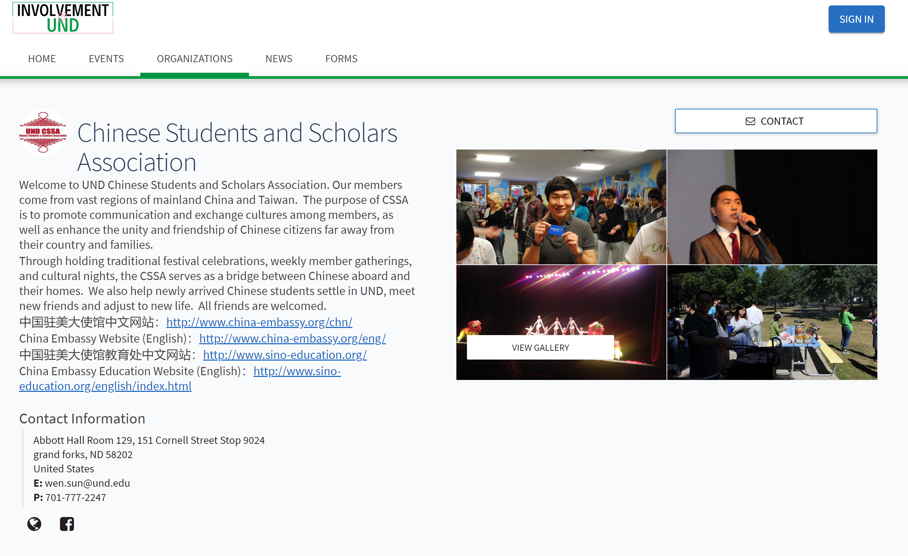

CSSA web is a website that I helped create and update as a team project in 2013. The project helped me learn how to design and implement a responsive web site.

CSSA is implemented using HTML. Within 3 weeks, we create the frame of the website and update all the desired information into the website.

In this project I gained experience with HTML to create a website and how to update the information within the website. Also I have learned how to work together as a team to finish the project.
 
Source: <a href="https://involvement.und.edu/organization/cssa"><i/>UND CSSA</a>
