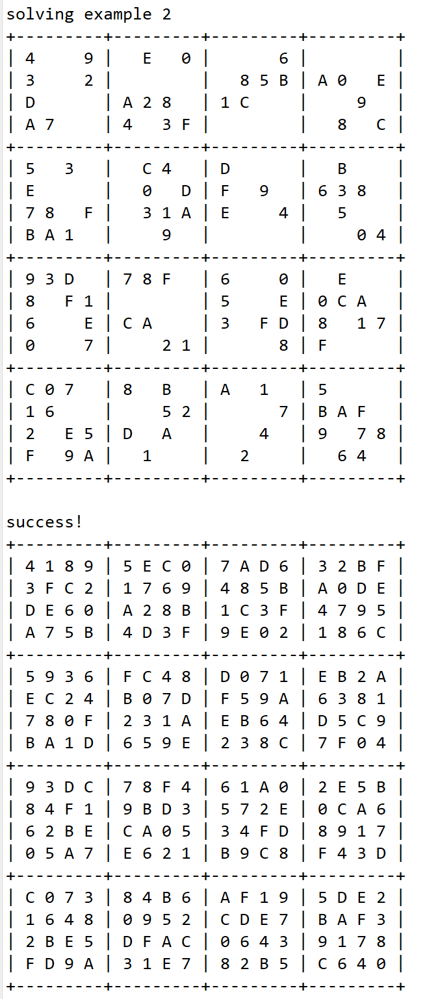
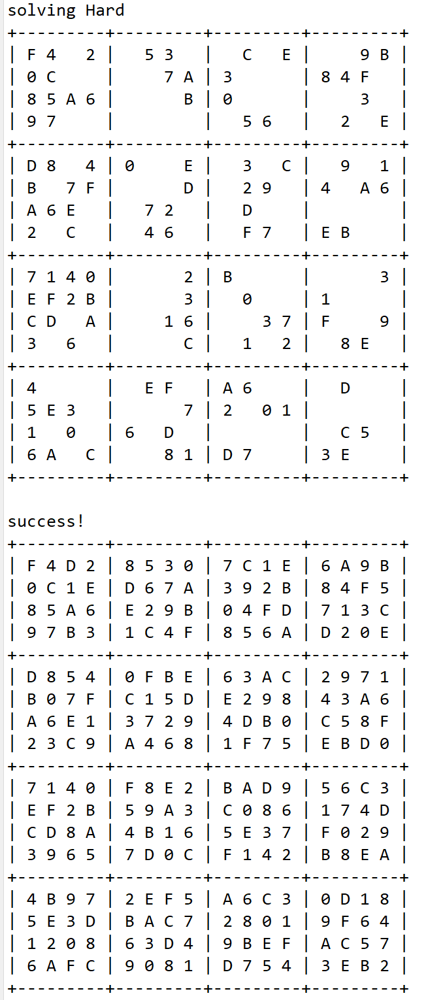
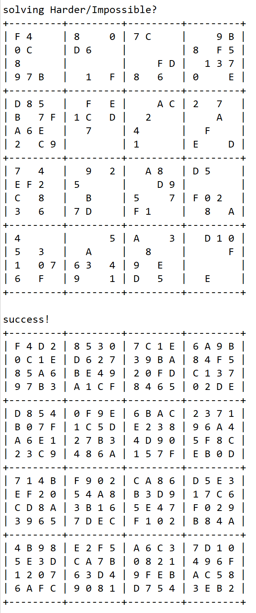

  
  
  

This program is designed to solve the hexadecimal sudoku. If it can solve the problem it will return the first possible solution. If it can not solve the problem it will give the statement of why it can not such as format error, value error and so on.

I wrote this program by myself with the help from instructor Cam Moore.

I learned how to check the legal value of the sudoku and how to fill it and also learned how computer is solving this kind problem.

Source: <a href="src/edu/ics211/h09/HexadecimalSudoku.java"><i class="large github icon "></i>ics211 Hexadecimal Sudoku</a>

