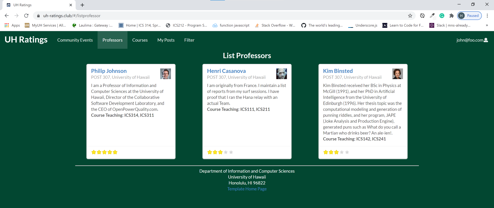
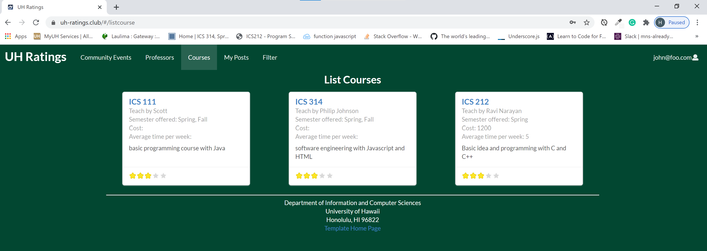

  
  
  

This web application is designed to rate the professors and courses in the UH and also provide the information of the UH community events.

My team and myself working together in the Github organization call uh-ratings to develop the app. And I use the DigitalOcean to deploy the web with the domain name purchased from NameCheap.

I learned how to work with a team in Github to produce the web app and also how to design and develop a web application. I also learned how to use testcafe to test the web application and the deployment of the web.

If you want to learn more about the development about this web app please visit [UH-ratings](https://uh-ratings.github.io/).

If you want to see the web app please visit [uh-ratings.club](https://uh-ratings.club).

Source: <a href="https://github.com/uh-ratings/uh-ratings"><i class="large github icon "></i>uh ratings</a>

