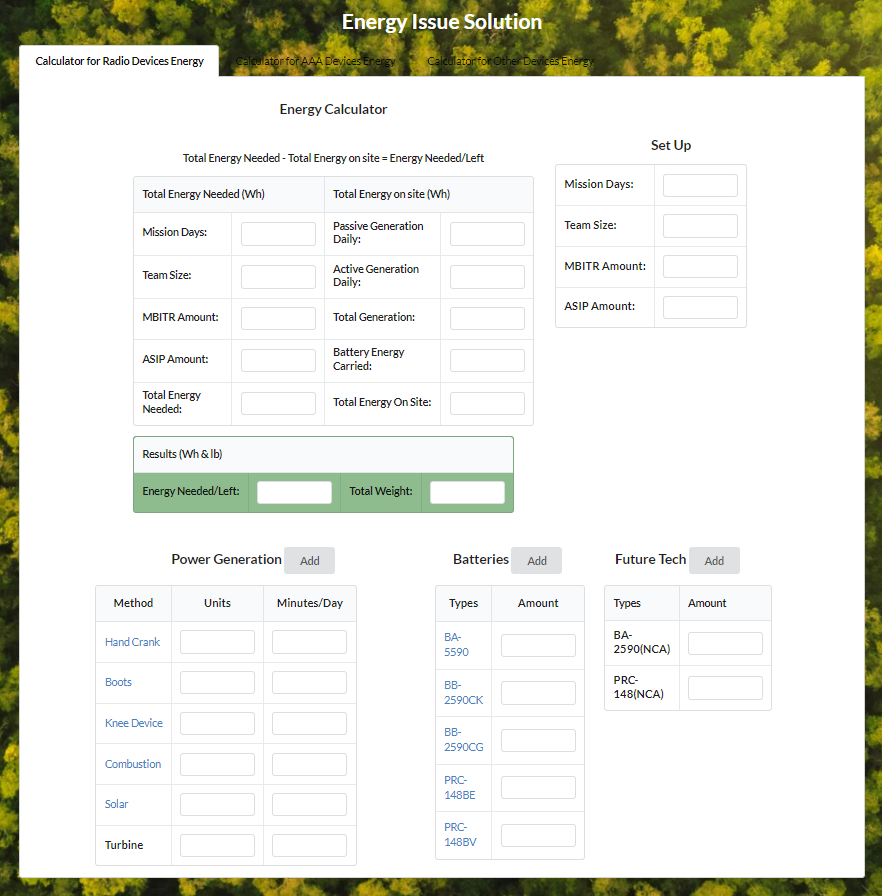

  

This web application is designed for my ENGR course 401 to solve the energy problem that proposed by the US Army. 
It serves as the planning tool and shows all the research data me and my teammates found.

If you want to learn more about the problem and research process please visit [Presentation File](https://docs.google.com/presentation/d/10OTFVSNFurj1d50fFgRK5rKDnQMf9FK_lsU3Khq_1cs/edit?usp=sharing).
And the technical report can be found at [Technical Writeup](https://docs.google.com/document/d/1z1xB_x7gYffiD330qATx8vijbnXUOP-RO1xolcd7eko/edit?usp=sharing)

If you want to see the web app please visit [Energy Calculator](https://hangbozhang.github.io/energy/).

Source: <a href="https://github.com/hangbozhang/energy"><i class="large github icon "></i>Energy</a>

