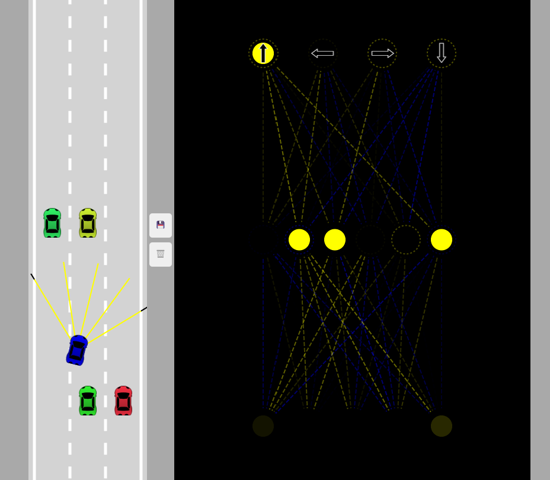

  

This web application is designed to simulate the self driving car (AI) by using the neural network. It will find the best path after a large amount of tries before hand.
The path can be stored locally for the future use. A two level neural network graph is also displayed on the app to help understand the car's behavior. 
The yellow lines are indicate the sensors, when the sensor touches anything it will turn black to indicate the signal sent back to the car. 
While the car touches anything, it will turn grey to indicate the collision and stop moving.

If you want to see the web app please visit [Self Driving Car](https://hangbozhang.github.io/self-drive-car/).

Source: <a href="https://github.com/hangbozhang/self-drive-car"><i class="large github icon "></i>JavaScript Codes</a>

