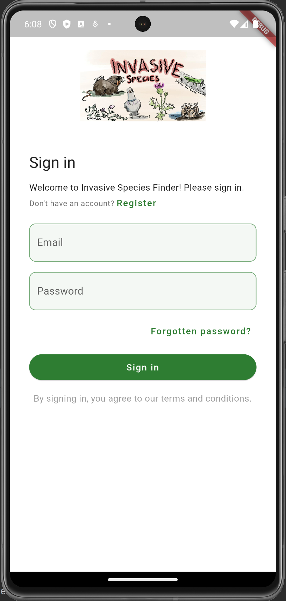

  

Hawaiian ecosystems are under high level of threat from numerous 
invasive species from all over the world. Invasive species are a 
major threat to endangered species and native ecosystems. 
They compete with native species for resources, and can even prey 
on native species directly. Invasive species can also introduce new 
diseases to the island and cause serious damage to the ecosystem or 
human beings. This mobile application is designed to address this problem.
If you want to know more about the mobile app please visit [Invasive Species](https://invasive-species.github.io/).

Source: <a href="https://github.com/invasive-species/invasive-species-finder"><i class="large github icon "></i>Flutter</a>

