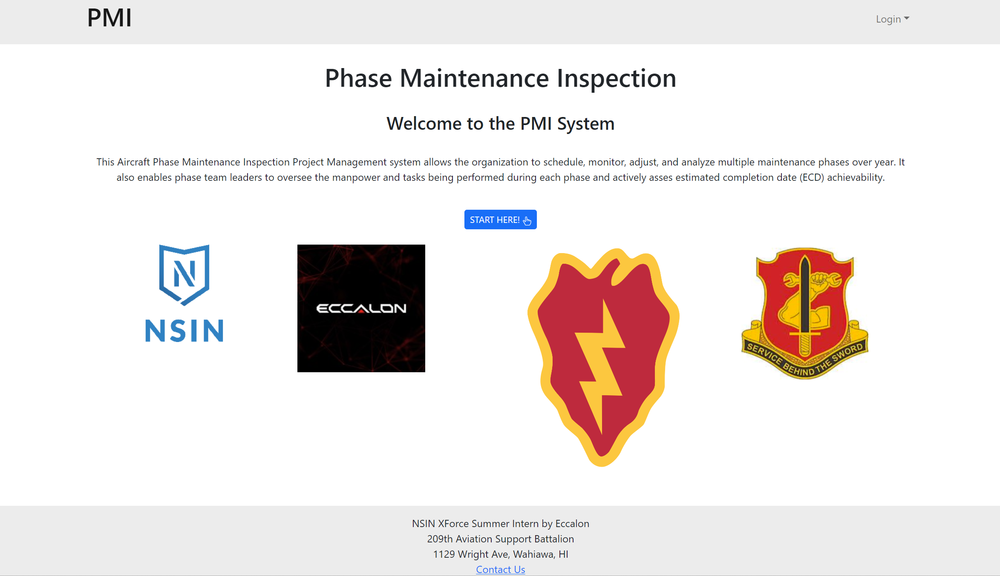

  

PMI-XFORCE-2023 is an Aircraft Phase Maintenance Project Management system that allows the organization to schedule, monitor, adjust, and analyze multiple maintenance phases over the year.

The application is built using:

- React and JavaScript for component-based UI implementation and routing.
- MongoDB for database

If you want to know more about the web app please visit [PMI-XFORCE-2023](https://pmi-xforce-2023.github.io/).
