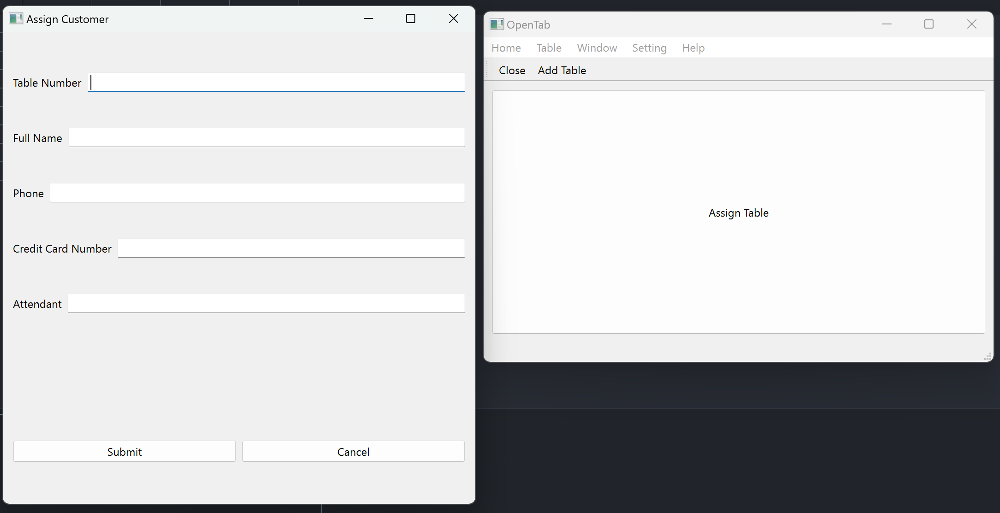

  

This is a desktop application designed to manage the table assignment for the restaurant. The application is built using:
- Python for the front-end and back-end
- SQLite for database

If you want to know more about the web app please visit [OpenTab](https://github.com/cybershield427/OpenTab).
